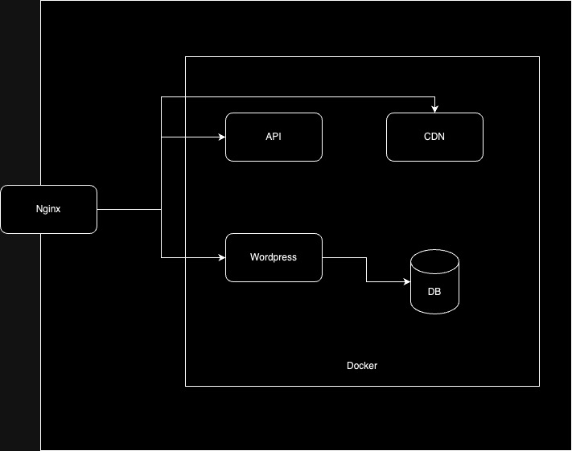

# belajar-docker
## Cerita
Disuatu hari yang cerah, dua sosok engineer devops sedang pusing dengan pekerjaannya. Engineer itu bernama Rizqi dan Wana. Mereka sedang duduk berdua sambil bertatapan penuh kasih sayang dikarenakan pusing dengan pekerjaan mereka untuk setup CDN, API, Wordpress dan DB Mysql untuk wordpress. Untuk CDN berisi file-file image yang boleh dipublish di Internet. CDN Tersebut dapat diakses melalui url https://nama.fathoniadi.dev/cdn-public/image. Untuk Wordpress dapat diakses dengan url https://nama.fathoniadi.dev sedangkan untuk api dapat diakses menggunakan url https://api.nama.fathoniadi.dev. CDN, API, Wordpress dan DB Mysql Wordpress dalam bentuk container. Akses domain-domain tersebut diatur di nginx yang terinstall pada server yang sudah tertanam certificate ssl. Bantulah mereka ya agar bahagia bersama :).
nama: disesuaikan masing-masing

Arsitektur:

Aturan main:
1. CDN harus dibuat image terlebih dahulu tidak boleh mount manual. Isi image cdn berisi foto bang dedi di folder image.
2. CDN dapat diakses ketika mengakses url https://nama.fathoniadi.dev/cdn-public/image/dedi.jpeg
3. Domain diatur di nginx server
4. SSL diatur di nginx server
5. Semua harus dalam bentuk single file docker compose
6. API yang boleh dimount manual hanya config nginxnya, code dibuat image
7. Config nginx dapat menggunakan nginx-default.conf dan di mount ke /etc/nginx/conf/sites-enabled/default
8. Code api di folder api di repository ini
9. Untuk base image api menggunakan fathoniadi/nginx-php:fs-7.4-2.0

